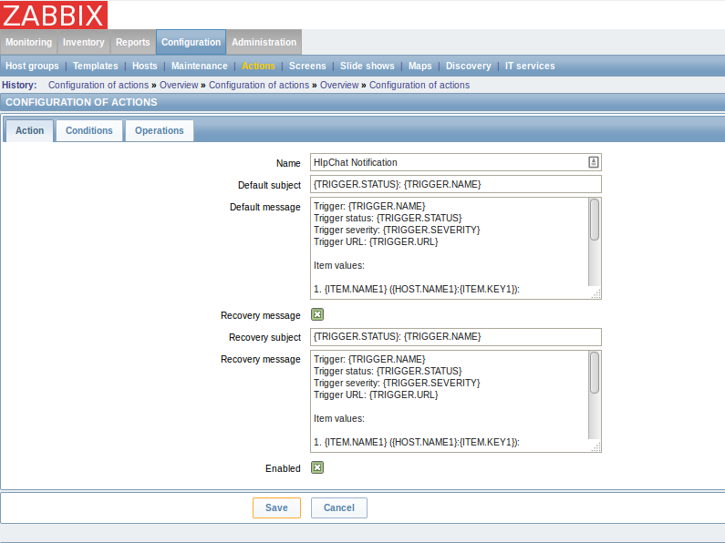
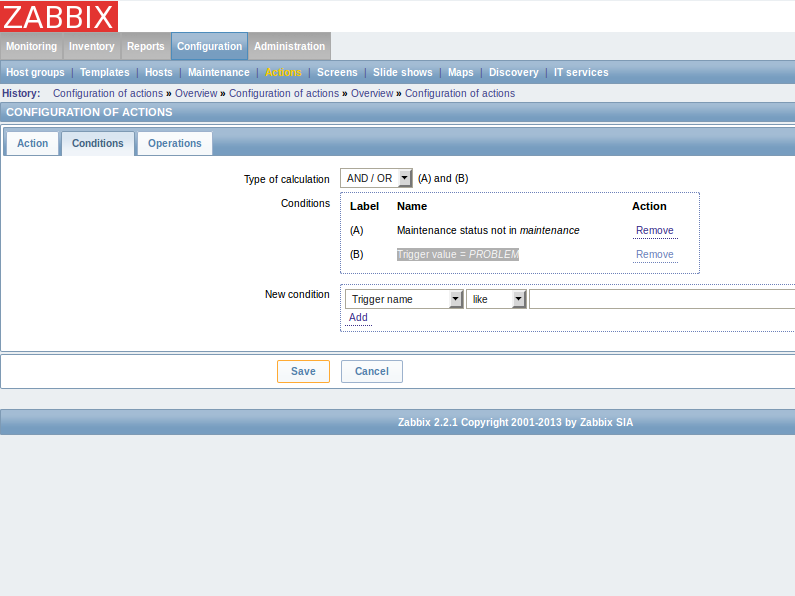
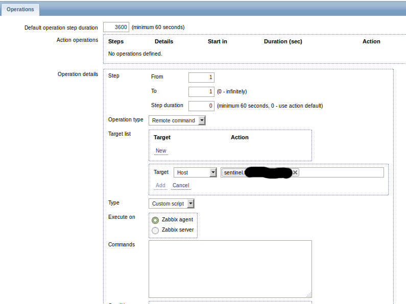
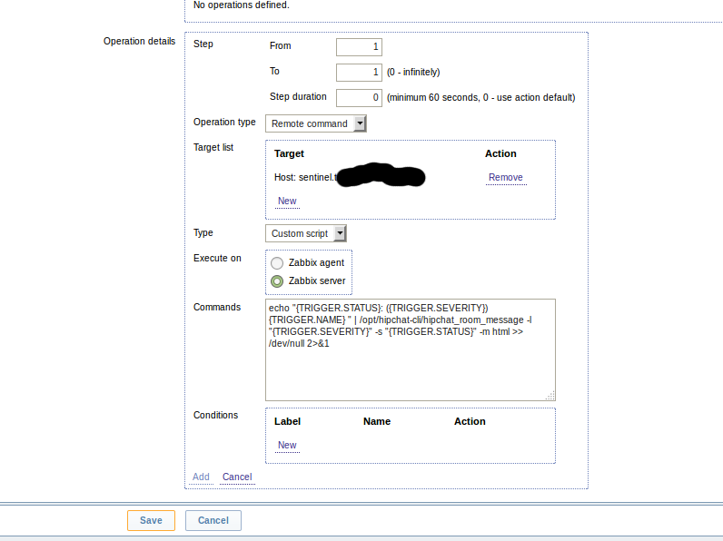
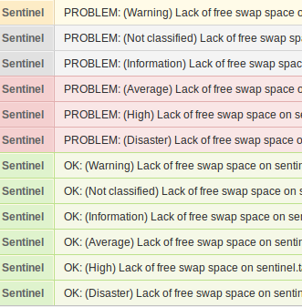

# hipchat-cli Zabbix Integration

This guide integrating hipchat-cli with a Zabbix Monitoring
Server to push trigger notifications to Hipchat.

## Setup hipchat-cli and Config File


Setup your Hipchat API credentials in /etc/hipchat

```
HIPCHAT_TOKEN=
HIPCHAT_ROOM_ID=
HIPCHAT_FROM=
HIPCHAT_API=v2
HIPCHAT_FORMAT=html
```
For added protection of the credentials, add a new user to own these files.

```
useradd -d /opt/hipchat-cli hipchat-cli
chown hipchat-cli:hipchat-cli /etc/hipchat
chmod 400 /etc/hipchat
```

Checkout hipchat-cli. Note that we are setting the SetUID / SetGID so that any
user can call this script and it will be able to read the credentials file, though 
the original user will not. 

```
git clone https://github.com/hipchat/hipchat-cli.git /opt/hipchat-cli
chown -R hipchat-cli:hipchat-cli /opt/hipchat-cli
chmod 6755 /opt/hipchat-cli/hipchat_room_message
```

## Setup the Zabbix Actions


#### Create a new Action



#### Conditions

To enable recovery messages, delete the default Condition ```Trigger value = PROBLEM```



#### Add a new Operation

* Operation Type: **Remote Command**
* Add a new Target
  * Target: **Host**
  * Select server (presumably the Zabbix server) running this script.
  * **Add**



* Execute on: **Zabbix Server**
* Commands: ```echo "{TRIGGER.STATUS}: ({TRIGGER.SEVERITY}) {TRIGGER.NAME} " | /opt/hipchat-cli/hipchat_room_message -l "{TRIGGER.SEVERITY}" -s "{TRIGGER.STATUS}" -m html >> /dev/null 2>&1```
* **Add**



Finally **Save** your new Action.

#### Break something to Trigger the Action



